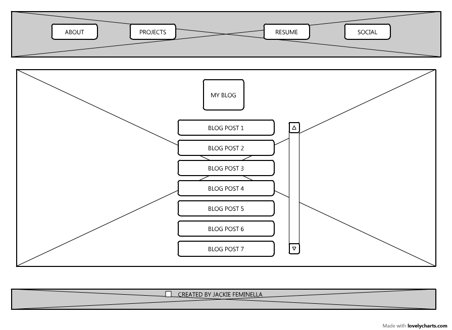

1.	What is a wireframe?
A wireframe is like “an architectural blueprint” that a designer/developer creates to define the information hierarchy of a website. Wireframing also allows the designer to think about how the end user will interact with this interface, and account for for various options that things could be laid out

2.	What are the benefits of wireframing?
Wireframing is a step in the web design & development process that comes before any thoughts about colors/copy/decoration of a website. This first step allows designers to plan the layout & interface of a website, and not get distracted by the other visual factors. 
 
3.	Did you enjoy wireframing your site?
I did enjoy it, I liked the visual aspect & the ability to workshop an idea. However, I’d like to find a better tool to wireframe with though, I used Lovely Charts and it felt a bit clunky and not intuitive to use.

4.	Did you revise your wireframe or stick with your first idea?
I revised my blog wireframe. I initially had two columns of links for my blog posts, but realized that I enjoy the experience of scrolling down a page in chronological order of posting date, and felt spacing them out this way could be best. 

5.	What questions did you ask during this challenge? What resources did you find to help you answer them?

I didn’t know what exactly should be in the body of my website, the bulk of the home page. I'm thinking it should be a brief description of myself, almost a headline, with my picture, but I'm still not sure.

6.	Which parts of the challenge did you enjoy and which parts did you find tedious?
I found the sizing of boxes in my wire-framing exercise to be most tedious. I would love a tool that sort of auto-snaps sizes to be equal, and I’m doing more research to find a better tool for next time.
